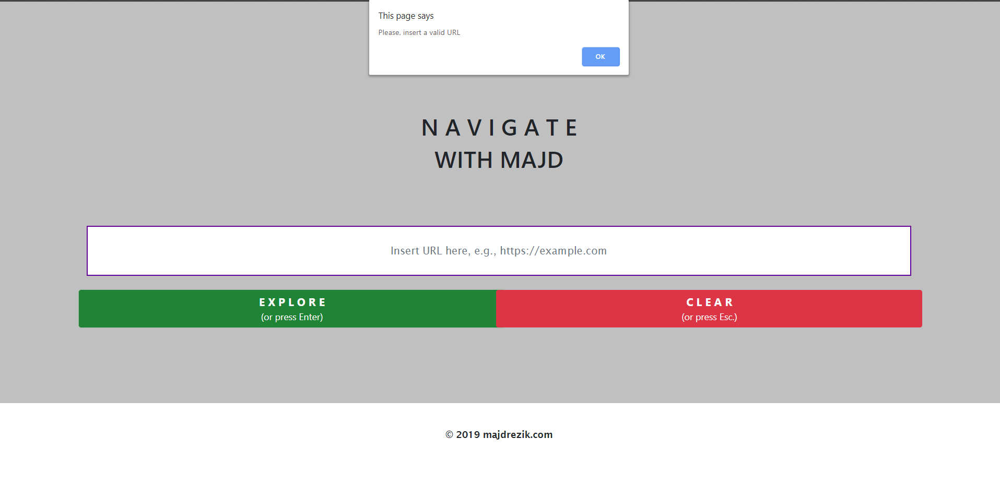
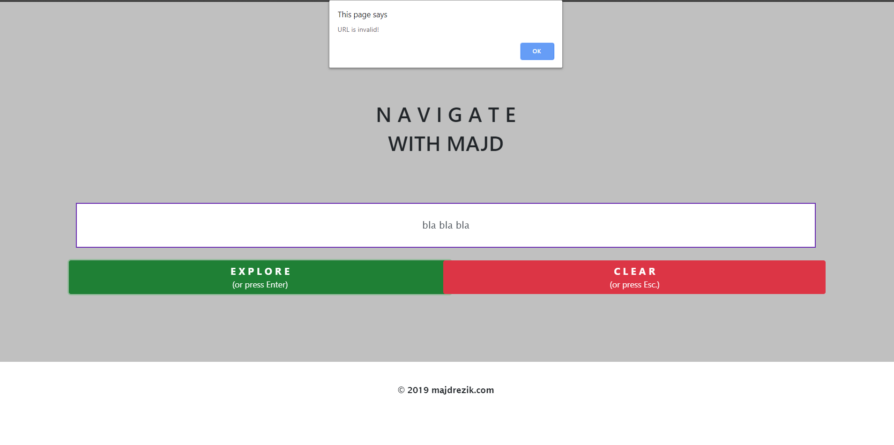

# Search-engine
**Search engine** that gets a URL/domain name as an input and redirects it to the relevant web page in case it is valid.
Technologies used:
1) HTML 5
2) CSS
3) JavaScript (ES6)
4) Bootstrap

**GUI**

**Not inserting any URL and trying to explore anyway**

**Inserting an invalid URL**

